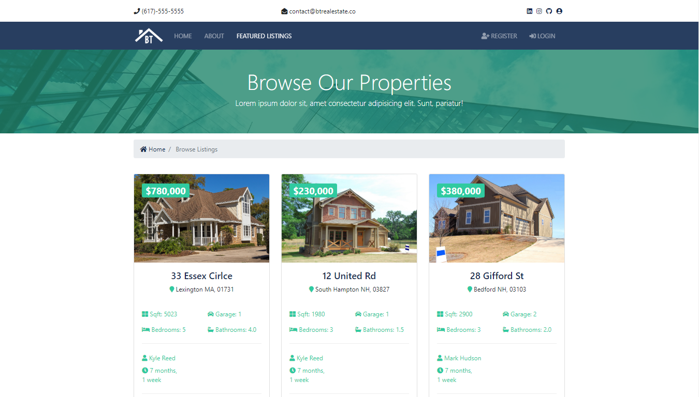
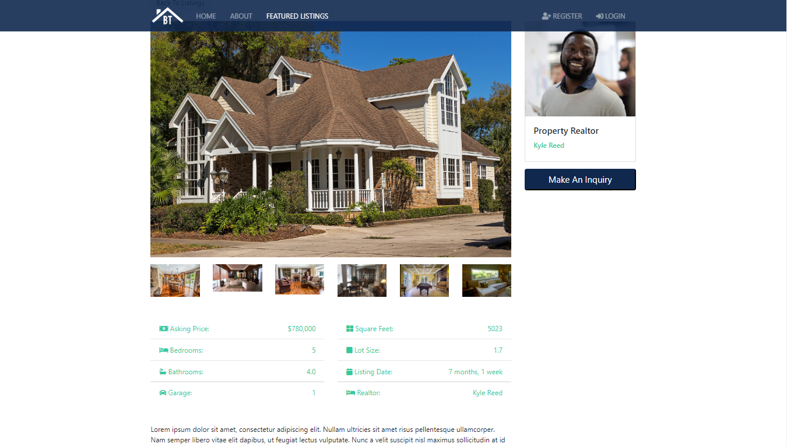
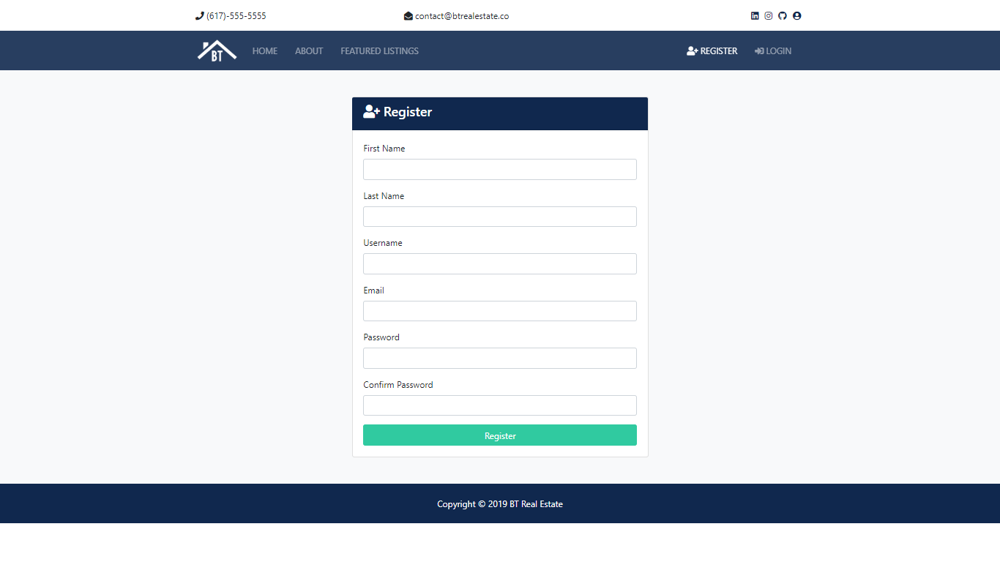
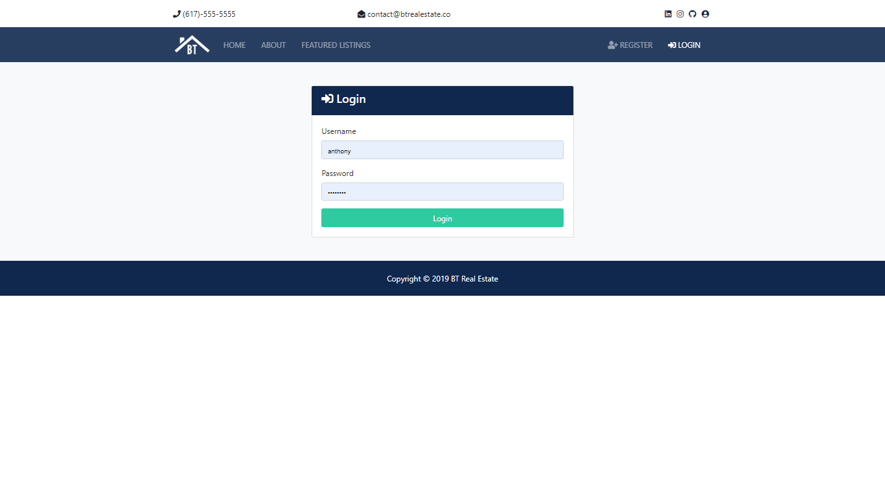
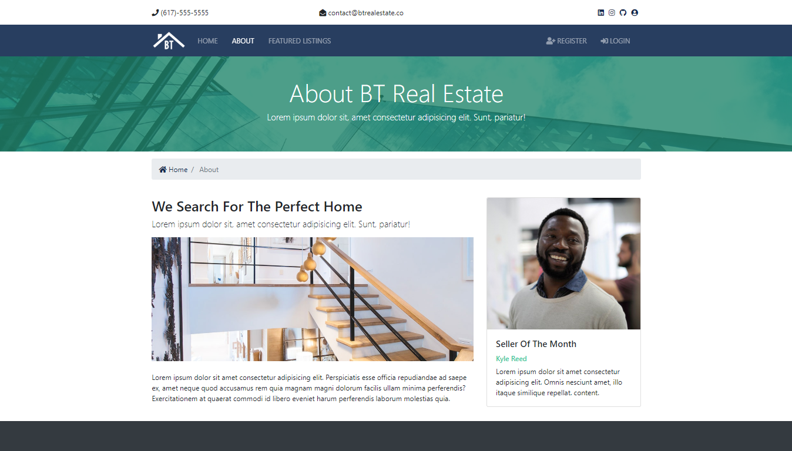

# BT_real_estate
🏠 Real Estate Website built using Django

The requirements listed are the ones I used at the time. Update the dependencies to prevent vulnerabilities
#
## Some of the Technologies used are:
* Python
* Django
* HTML/CSS/JS
* Bootstrap

#
Home

Listings

Listing

Register

Login

About

## obelouch
